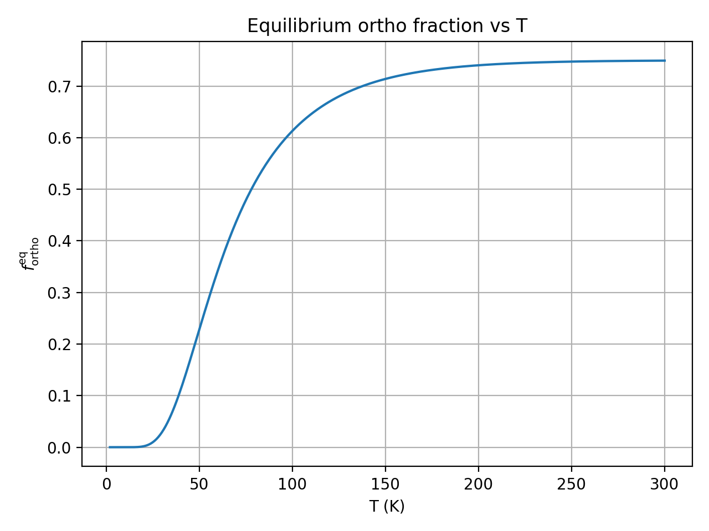
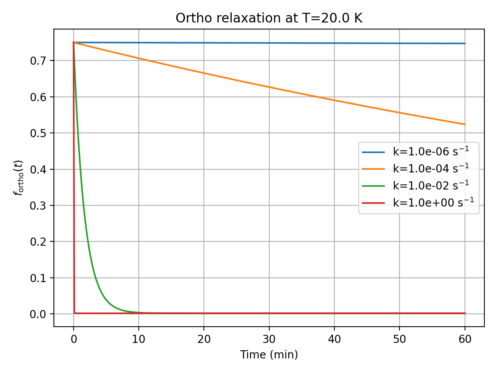

# Ortho–Para H₂ Kinetics

> Equilibrium and relaxation of ortho–para hydrogen with a tiny, reproducible Python package.  
> **Why it matters:** spin isomer composition impacts low-T hydrogen storage, cooling and materials testing.




**Skills:** scientific Python, ODEs, packaging, testing (pytest), CI, CLI design, reproducibility (Pixi).

# Ortho–Para H₂ Kinetics (Toy Model)

Compute:
- Equilibrium ortho fraction $f_\mathrm{ortho}^{eq}(T)$
- Simple first-order relaxation $\dot f = -k (f - f_{eq}(T))$

## Quick start

### Using pip
```bash
python -m venv .venv && source .venv/bin/activate
pip install -e . pytest
python scripts/plot_equilibrium.py
python scripts/plot_relaxation.py
pytest -q

